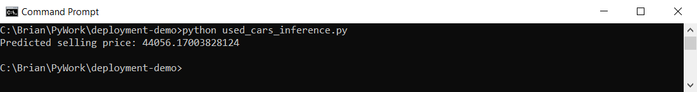
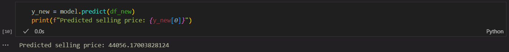
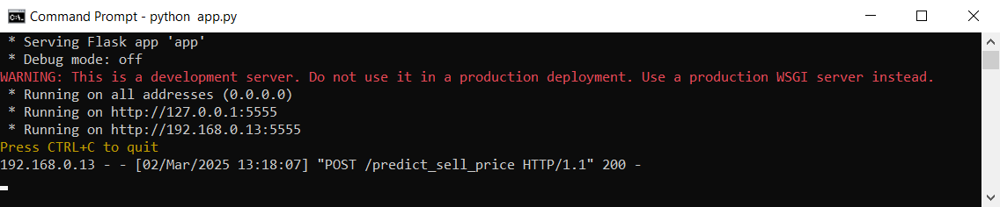
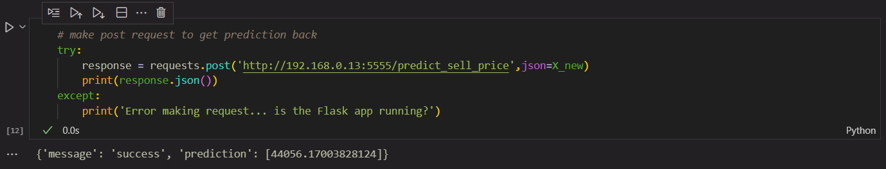
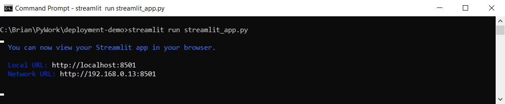
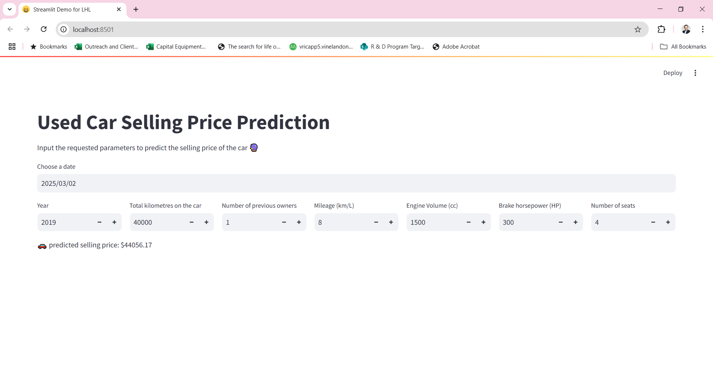

# Machine Learning Model Deployment Demo

Brian Lynch 2025

This repository demonstrates a simple model built in a Jupyter notebook and saved as a pickle file. The model is then loaded in another notebook as well as a script to demonstrate loading and running the model outside of the original notebook. A Flask app and Streamlit app are also demonstrated for deployment (with the inference notebook demonstrating how to call the Flask app for prediction).

### File structure

> ```
> deployment-demo
> |--- \data (contains source data in CSV format)
> |--- \images (contains screenshots for this README)
> |--- \models (where the model pickle file is stored)
> |--- app.py (the demo Flask app)
> |--- README.md (this README)
> |--- used_cars_inference.ipynb (the demo notebook for loading and running the model as well as calling the Flask app)
> |--- used_cars_inference.py (demo of loading and running the model in a Python script)
> |--- used_cars_model.ipynb (the notebook where we first build the model)
> ```

### Creating the model
We first create the model using the code shown in the `used_cars_model.ipynb` notebook, which then saves the model in a pickle file (in the `\models` directory).

### Inference in a Python script
The Python script `used_cars_inference.py` can be run in a terminal to run a prediction with the model.



### Inference in a Jupyter notebook
The Jupyter notebook `used_cars_inference.ipynb` can be used to run a prediction with the model but within a notebook.



### Flask app
The file `app.py` is a script that starts up a Flask API when run in a terminal.



We can then see the results of making a POST request to the API in the notebook `used_cars_inference.ipynb`.



### Streamlit app
The file `streamlit_app.py` demonstrates an example Streamlit app that when run in a terminal using `streamlit run streamlit_app.py` will start up a browser window showing our user-friendly Streamlit app.





